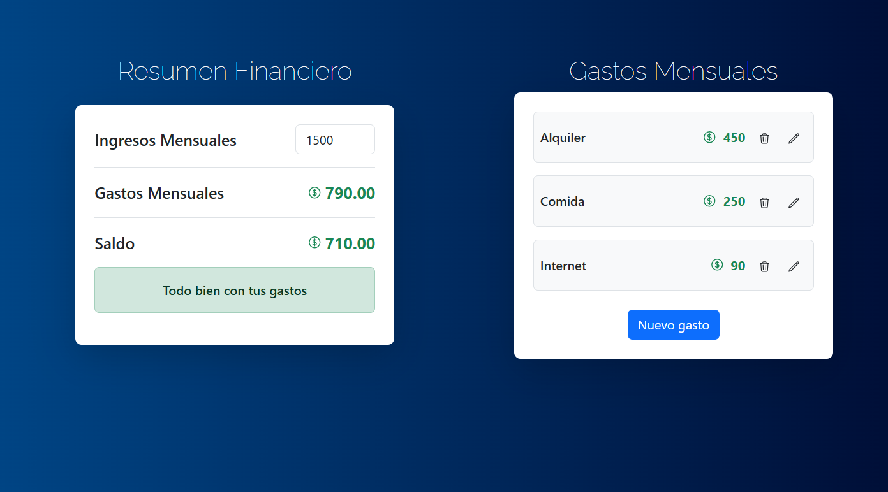

# 💸 Control de Gastos Personales

Una aplicación web desarrollada con **React + TypeScript** para gestionar ingresos y gastos mensuales. Permite agregar, editar y eliminar gastos, y muestra alertas visuales según tu nivel de presupuesto.

---

## 📷 Vista previa



---

## 🚀 Funcionalidades principales

- 📥 Agrega gastos con nombre y monto
- 🔁 Edita y elimina gastos existentes
- 📊 Calcula saldo y porcentaje de gasto automáticamente
- 💾 Persistencia en `localStorage` (los datos no se borran al recargar)
- ✅ Validación de formularios (nombre solo letras, monto válido)
- 🚫 No permite exceder el presupuesto mensual
- 📱 Diseño **responsive** con Bootstrap

---

## 🛠️ Tecnologías utilizadas

- React + TypeScript
- React Router
- Bootstrap 5
- React Toastify
- LocalStorage (navegador)

---

## 📦 Instalación local

1. Clona el repositorio:

```bash
git clone https://github.com/MiguelChahua/control-gastos.git
cd control-gastos
```

2. Instala las dependencias

npm install

3. Ejecuta el servidor

npm run dev

La app estará disponible en: http://localhost:5173

---

## Notas adicionales

- El presupuesto por defecto es 1200, pero puedes cambiarlo manualmente en la app.
- No es necesario registrarse ni iniciar sesión, los datos se guardan localmente.
- La app es ideal para uso personal o como base para futuros proyectos más completos (por ejemplo, con autenticación o conexión a una base de datos).

---

## Autor

Miguel Ángel Chahua Villanueva

📩 Contacto: miguel.ang.cv95@gmail.com
🧑‍🧒‍🧒 Linkedin: (https://www.linkedin.com/in/miguel-angel-chahua-villanueva-38579112a/)
